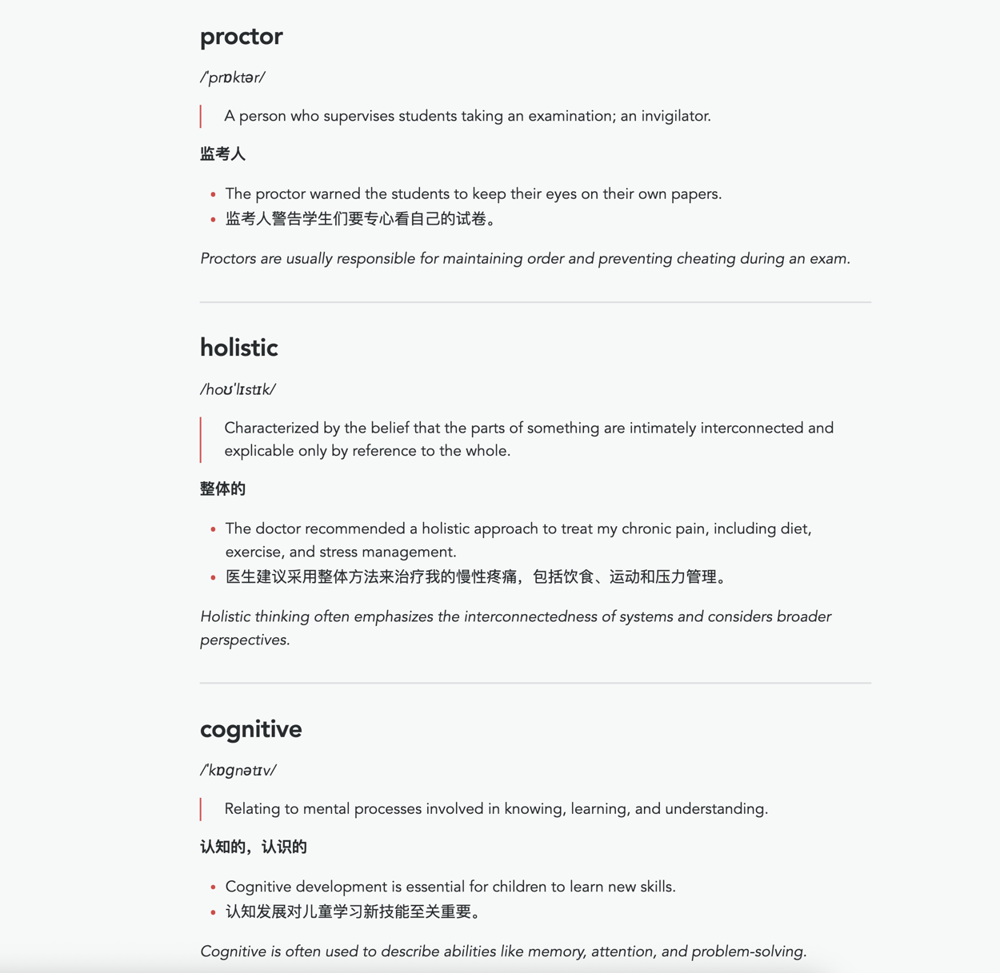

# Word4You - AI-Powered Word Learning & Collecting Tool.

Build your own vocabulary notebook, query word with AI and save it to local markdown file, accumulating your vocabulary
daily.

You can use it on your work and home Mac and keep syncing your vocabulary notebook using Git with smart conflict
resolution,
or just put it in your obsidian vault, using obsidian plugin to do the synchronization.

## Provided tools:

- **[word4you-cli](./word4you-cli/README.md)**: A command-line tool for learning English words with AI-powered
  explanations using Google Gemini API.
- **[word4you-extension-raycast](./word4you-extension-raycast/README.md)**: Raycast extension for quick access to
  Word4You CLI.

## Features

- 🤖 **Dual AI Support**: AI-powered explanations using Google Gemini API or Qwen API
- 🌍 **Multilingual Input**: Support for words, phrases, and sentences in English, Chinese, and mixed languages
- 🔄 **Bi-directional Translation**: Seamless translation between Chinese and English
- 📚 **Smart Classification**: Automatically detects input type and provides appropriate explanations
- ✍️ **Compose Sentences**: Generate sentences using two words with AI for practice
- 📝 **Markdown Vocabulary**: Easily readable and editable vocabulary notebook
- 🔄 **Git Sync**: Backup and synchronization with smart conflict resolution
- 🎨 **Rich UI**: Beautiful terminal interface and Raycast extension

## Screenshot
Word4you CLI

Word4You Raycast Extension

Saved vocabulary notebook(View in Obsidian)

