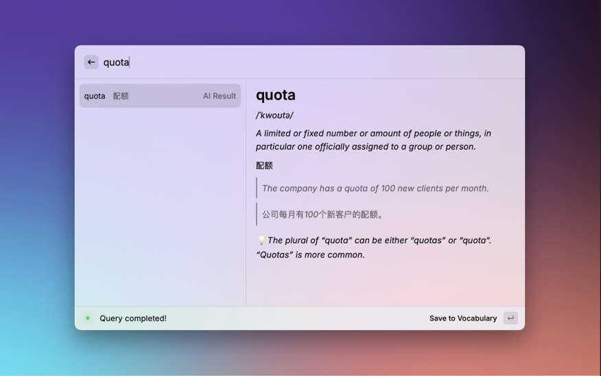

# Word4You - AI-Powered Word Learning & Collecting Tool.

Build your own vocabulary notebook, query word with AI and save it to local markdown file, accumulating your vocabulary
daily.

You can use it on your work and home Mac and keep syncing your vocabulary notebook using Git with smart conflict
resolution,
or just put it in your obsidian vault, using obsidian plugin to do the synchronization.

## Provided tools:

- **[word4you-cli](./word4you-cli/README.md)**: A command-line tool for learning English words with AI-powered
  explanations using Google Gemini API.
- **[word4you-extension-raycast](./word4you-extension-raycast/README.md)**: Raycast extension for quick access to
  Word4You CLI.

## Features

- 🤖 AI-powered word explanations using Google Gemini API
- 📚 Markdown vocabulary notebook easily readable and editable and convertible to other formats
- 🔄 Git backup/sync with smart conflict resolution
- 🎨 Rich terminal UI/Raycast extension

## Screenshot
Word4you CLI

Word4You Raycast Extension

