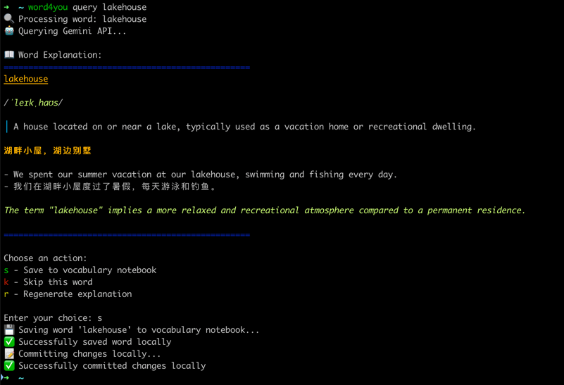

# Word4You - Multilingual Learning CLI Tool

A fast, efficient command-line tool for learning words, phrases, and sentences in English and Chinese with AI-powered explanations using Google Gemini or QWEN, written in Rust.

## Features

- 🌍 **Multilingual Support**: English, Chinese, and mixed-language input
- 🧠 **Smart Classification**: Automatically detects language and input type (word/phrase/sentence)
- 🤖 **AI-powered explanations**: Google Gemini or QWEN with specialized prompts
- 📝 **Adaptive Templates**: Different explanation formats for words, phrases, and sentences
- 🔄 **Git backup/sync** with smart conflict resolution
- 📚 **Markdown vocabulary notebook**
- 🎨 **Rich terminal UI**
- ⚡ **Fast execution** (Rust)

## Screenshot
CLI



Saved vocabulary notebook(View in Obsidian)


## Quick Start
1. Download the [appropriate binary](https://github.com/gnehz972/word4you/releases) for your system and rename it to `word4you`
2. Make it executable: `chmod +x word4you`
3. Add it to your PATH:
   ```
   mv word4you $HOME/dev/bin/
   export PATH="$HOME/dev/bin:$PATH"
   ```
4. Configure your API keys:
   - **Gemini**: Get API key from [Google AI Studio](https://aistudio.google.com/app/apikey)
   - **QWEN**: Get API key from [Alibaba Cloud DashScope](https://dashscope.console.aliyun.com/)
5. Run it(API Key is required, for Mac users, you need to allow it to run for the first time in System Preferences > Security & Privacy):
   ```
   word4you query beautiful
   word4you query beautiful --provider gemini  # Use Gemini
   word4you query beautiful --provider qwen    # Use QWEN
   ```

## Backward Compatibility

If you have an existing Word4You configuration, it will be automatically migrated to the new format when you first run the updated version. The migration process:

- Preserves your existing Gemini API key and settings
- Sets QWEN as an optional provider (you can configure it later)
- Maintains all your vocabulary and Git settings
- Automatically saves the migrated configuration

You'll see a message like "ℹ️  Migrating configuration from old format to new format..." during the migration process.

## Multilingual Input Support

Word4You now supports English, Chinese, and mixed-language input with intelligent classification:

### Language Detection
- **English**: `hello`, `break the ice`, `The early bird catches the worm.`
- **Chinese**: `你好`, `打破僵局`, `早起的鸟儿有虫吃。`
- **Mixed**: `Hello 你好`, `API接口`, `I love 中国菜!`

### Input Type Classification
- **Words**: Single words in any language
- **Phrases**: Short expressions (2-5 words in English, 2-7 characters in Chinese)
- **Sentences**: Complete sentences with punctuation or longer expressions

### Adaptive Explanations
Each combination gets a specialized prompt template:
- **English words**: Full phonetic, definition, Chinese translation, examples
- **Chinese words**: Pinyin, English definition, bilingual examples
- **Phrases**: Meaning, usage context, examples (no phonetics)
- **Sentences**: Translation with grammar and cultural notes

## Commands

```bash
# Interactive mode (enter words, phrases, or sentences)
./target/release/word4you

# Query any text (automatically classified)
./target/release/word4you query beautiful      # English word
./target/release/word4you query "break the ice" # English phrase
./target/release/word4you query "Hello world!"  # English sentence
./target/release/word4you query 你好             # Chinese word/phrase
./target/release/word4you query "早起的鸟儿有虫吃。" # Chinese sentence
./target/release/word4you query "Hello 你好"     # Mixed language

# Specify AI provider
./target/release/word4you query beautiful --provider gemini  # Use Gemini
./target/release/word4you query beautiful --provider qwen    # Use QWEN

# Other commands
./target/release/word4you test                 # Test API connection
./target/release/word4you config               # Configure the application
./target/release/word4you save <text> --content <content>    # Save content
./target/release/word4you delete <text> [--timestamp <timestamp>] # Delete entry
./target/release/word4you update <text> --content <content> [--timestamp <timestamp>] # Update entry
./target/release/word4you --help               # Show help
```

## Interactive Mode

When you run `word4you` without any arguments, it enters interactive mode:

```
🎯 Welcome to Word4You Interactive Mode!
Enter words to learn, or type 'exit' to quit.

Enter a word to learn: beautiful
🔍 Processing word: beautiful
🤖 Querying Gemini API...

📖 Word Explanation:
==================================================

## beautiful

*/ˈbjuːtɪfl/*

> Pleasing the senses or mind aesthetically.

**美丽**

- She has a beautiful smile.
- 她有一个美丽的笑容。

*The word "beautiful" is often used to describe things that are visually appealing, but can also be used to describe things that are admirable or morally good.*

==================================================

Choose an action:
s - Save to vocabulary notebook
k - Skip this word
r - Regenerate explanation

Enter your choice: k
✔️ Word explanation skipped.

==================================================

Enter a word to learn: exit
👋 Goodbye!
```

### Vocabulary Notebook Store Directory Structure

The program automatically creates a dedicated `word4you` subdirectory for easy backup/sync the vocabulary notebook:

```
{VOCABULARY_BASE_DIR}/
└── word4you/                    # Dedicated directory for Word4You
    ├── .git/                    # Git repository (auto-initialized)
    └── vocabulary_notebook.md   # Your vocabulary notebook
```

## Vocabulary Notebook

Words are saved in `{VOCABULARY_BASE_DIR}/word4you/vocabulary_notebook.md` with:
- 📝 Phonetic symbols (IPA)
- 🇨🇳 Chinese translations
- 🌍 Bilingual examples
- 📖 Detailed definitions
- 🏷️ Usage notes and tips

Check the [sample vocabulary notebook](./sample_vocabulary_notebook.md) for an example.


## Build and Run locally

1. **Install Rust** (if not installed):
   ```bash
   curl --proto '=https' --tlsv1.2 -sSf https://sh.rustup.rs | sh
   ```

2. **Setup project**:
   ```bash
   git clone <your-repo-url>
   cd word4you-cli
   ```

3. **Build and run**:
   ```bash
   cargo build --release
   ./target/release/word4you
   ```

4. **Follow the config process**:
   - The first time you run Word4You, it will guide you through the setup process
   - You'll need a Google Gemini API key (get one at [Google AI Studio](https://aistudio.google.com/app/apikey))
   - The configuration will be saved to `$HOME/.config/word4you/config.toml`

   
## Requirements

- Rust 1.70+
- Google Gemini API key
- Git (optional)